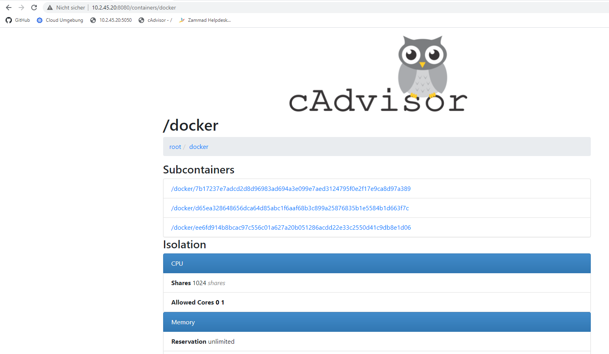

# M300-Services-LB02

## 30 Container
Was ist Containersierung und was sind die Vorteile?

Container ist die lightweight Lösung um verschiedene Services im Netz bereitzustellen. Sie bringen mehrere Vorteile mit sich, zum Beispiel sind sie Ressourcensparend, leicht zum managen / migrieren und leicht zun skalieren. Mit Container fällt es uns jetzt schon einfacher gewisse Tasks zu machen, vorallem wenn dann noch eine Orchestrierung vorhanden ist, wie zum Beispiel Kubernetes, ist viel möglich.

### 01 Docker 
Docker ist eine Freie Software zur Isolierung von Anwendungen mit Hilfe von Containervirtualisierung. Docker ist die am verbreitendste Container Software, jedoch heutzutage auch nicht mehr immer die erste Wahl. Auch Kubernetes hat den Support zu Docker bereits aufzuhören angekündigt. Da es aber nahc wie vor die verbeitendste Technologie ist, haben wir Docker für die Projekte verwendet.


### 02 Virtuelle Maschine vs Docker

Nun stellt sich eine berechtigte Frage, was ist dr Unterschied von einem Container zu den klassischen VMs welche wir heute benutzen und lieben? Um dies einem näherzubringen ist diese Abbildung da. Aus dieser ist zu entnehmen, dass bei jedem Container jeweils immer das Betriebssystem gespart wird, da Container auf Kernelebene funktionieren.


### 03 Webserver einrichten
In diesem Schritt haben wir das Dockerfile selber gebaut und anschliessend das Image bereitgestellt und den Container von dem Image aus gestartet. Hier das Dockerfile:

````
#
#       Einfache Apache Umgebung
#
FROM ubuntu:14.04
MAINTAINER Marcel mc-b Bernet <marcel.bernet@ch-open.ch>

RUN apt-get update
RUN apt-get -q -y install apache2

# Konfiguration Apache
ENV APACHE_RUN_USER www-data
ENV APACHE_RUN_GROUP www-data
ENV APACHE_LOG_DIR /var/log/apache2

RUN mkdir -p /var/lock/apache2 /var/run/apache2

EXPOSE 80

VOLUME apache:/var/www/html

CMD /bin/bash -c "source /etc/apache2/envvars && exec /usr/sbin/apache2 -DFOREGROUND"
````

Wie auch hier ersichtlich ist wurde auch gelcieh ein Volume mitgegeben. Dieses Volume sagt nichts anderes als dass er die Daten für das Verzeichnis /var/www/html vom Host abholen soll.

Anschliessend wurde der Host über den folgenden Befehl gestartet und der Port 80 wurde auf den Port 5050 weitergeleitet:

````
docker run -dit --name apachevolume -p 5050:80 apachevolume 
````

Hier der laufende Webserver mit dem persistenten Speicher:


### 04 PHPMyAdmin und MySql kombinieren und verwenden.

In diesem Abschnitt geht es rein um das kombinierte verwendet von MySQL und PHPMyAdmin. Dazu haben ich mich an bestehenden Images bedient und die Zwei Anwendungen zum Zusammenarbeiten gebracht. Folgendermassen wurden die Container gestartet.

#### MySQL
Zuerst wurde das Image heruntergalden...

````
$ docker pull mysql:8.0.1
````

Und anschliessend wurde der Container bereitgestellt.

````
$ docker run --name my-own-mysql -e MYSQL_ROOT_PASSWORD=mypass123 -d mysql:8.0.1
````

#### PHPMyAdmin
Zuerst wurde das Image heruntergalden...

````
docker pull phpmyadmin/phpmyadmin:latest
````

Und anschliessend wurde der Container bereitgestellt.

````
docker run --name my-own-phpmyadmin -d --link my-own-mysql:db -p 8081:80 phpmyadmin/phpmyadmin
````

Sobald beide Systeme aufgesetzt wurden, kann dies überprüft werden, indem man versucht sie über das Web zu erreichen über localhost:8081


### 05 Ticketsystem

Als Zusatz wollte ich auch ein Ticketsystem laufen lassen, also habe ich mich für das Ticketsystem Zammad entschieden. Damit ich das zum laufen kriege wurde auch hier zuerst das Image heruntergeladen:

````
docker pull zammad/zammad
````

````
docker container run --rm --name zammad -p 8081:80 zammad/zammad 
````

Anschliessend kann auch das Ticketsystem getestet werden indem man veruscht über das Webinterface zuzugreifen:


Nach der Konfiguration sieht das Ticketsystem wie folgt aus:

 

Mehr zu meinen Ideen zum Ticketsystem ist unter dem Kapitel Kubernetes zu finden.


### 06 Docker Befehle

Folgend eine von mir nachgeführte Liste zu den wichtigstesn Docker Befehlen:

| Befehl            | Funktion                                             |
| -------------     | ---------------------------------------------------- | 
| ```docker pull```     | Holt ein Image. |
| ```docker run```      | Started VM mit dem ausgewähltem Image. |
| ```docker ps```       | Zeigt laufende Maschinen. |
| ```docker version```  | Zeigt die Docker Version von Echo-Client und Server an. |
| ```docker images```   | Listet alle Docker Images auf. |
| ```docker exec```     | Führt einen Befehl in einem laufenden Container aus. |
| ```docker search```   | Durchsucht das Docker Hub nach Images. |
| ```docker attach```   | Hängt etwas an einen laufenden Container an. |
| ```docker commit```   | Erstellt ein neues Image mit den Änderungen, die an einem Container vorgenommen worden sind. |
| ```docker stop```     | Haltet die gewünschte Maschine an. |
| ```docker volumes```     | Zeigt mit anderen Parametern die Volumes an, um die Container zu sichern.. |
| ```docker build```     | Baut aus einem Dockerfile ein Docker Image |
| ```docker port```     | Zeigt verschiedene Portmappings von Container an |


### 05 Netzwerkplan

Hier ist mein Netzwerkplan zu sehen. Was einem auffallen mag, aber nicht ganz Verständlich ist auf dem ersten Blick ist, warum ich jeweils immer zuert ein VPN aufbaue über den M300CL01 und danach auf den m300-20-st18c, wenn ich doch von meinem PC aus mich auf dem m300-20-st18c hätte verbinden können. Das liegt daran ganz einfach daran, dass ich nicht immer irgendwelche Programme auf meinem Privaten PC installieren möchte, deshalb mache ich das auf einer VM, welche ich nach dem Modul wieder löschen werde.


## 35 Sicherheit

### 01 Serviuce Überwachung 
Hier habe ich das Programm Cadvisro in den Betrieb genommen um Standardwerte von einem Container mir anschauen zu können wie zum Beispiel die CPU Belastung der Speicher etc. Dazu wurde als erstes das Image google/cadvisor vom Dockerhub heruntergeladen.

Hier ein allgemeiner Auszug meiner Images, unteranderem auch das Image vom Cadvisor.


Im nächsten Schritt wurde der Container auch schon gestartet und der Port 8080 wurde auf den Port 8080 weitergeleitet. Dazu wurde folgender Befehl verwendet:

````
docker run --volume=/:/rootfs:ro --volume=/var/run:/var/run:rw --volume=/sys:/sys:ro --volume=/var/lib/docker/:/var/lib/docker:ro   --publish=8080:8080   --detach=true --name=cadvisor2 google/cadvisor:latest
````

Zum Schluss kann man dann mit dem ausgewählte Port bei mir wäre dies jetzt 8080, auf die Seite via Browser zugegriffen werden. 



### 02 Logging

Die Logs können über den Befehl docker logs abgerufen werden. Es gibt mehrere Werte, die man über das Argument von docker auswählen kann:

* json-file 

Ausgaben abholen:
````
$ docker run --name logtest ubuntu bash -c 'echo "stdout"; echo "stderr" >>2'
$ docker logs logtest
$ docker rm logtest
````
Laufende Ausgaben:
````
$ docker run -d --name streamtest ubuntu bash -c 'while true; do echo "tick"; sleep 1; done;'
$ docker logs streamtest
$ docker logs streamtest | wc -l
$ docker rm streamtest
````

Protokollierung in das System-Log des Hosts:
````
$ docker run -d --log-driver=syslog ubuntu bash -c 'i=0; while true; do i=$((i+1)); echo "docker $i"; sleep 1; done;'
$ tail -f /var/log/syslog
````

### 03 Weitere Sicherheitstipps

Hier sind noch weitere Sicherheitstipps welche einem bei einer Verbesserung oder Verschäfung der Sicherheit helfen könnten.

* Netzwerkzugriff beschränken
* Zugriff begrenzen
* Zugriff Monitoren
* setuid/setgid-Binaries entfernen
* Speicher begrenzen

````
$ docker run -m 128m --memory-swap 128m amouat/stress stress --vm 1 --vm-bytes 127m -t 5s
````

* CPU beschränken
````
$ docker run -d --name load3 -c 512 amouat/stress
````
* Neustarts begrenzen
````
$ docker run -d --restart=on-failure:10 my-flaky-image
````
* Zugriffe aus Dateisysteme begrenzen
````
$ docker run --read-only ubuntu touch x
````
* Capabilities einschränken
````
$ docker run --cap-drop all --cap-add CHOWN ubuntu chown 100 /tmp
````
* Ressourcenbeschränkungen anwenden
````
$ docker run --ulimit cpu=12:14 amouat/stress stress --cpu 1
````

## 40 Kubernetes (k8s)

### 01 Einleitung

Ich habe mich sehr auf Kubernetes gefreut, da ich den immensen Nutzungsgebiet vom Programm sehe, leider lief nicht alles wie geplant. Ich habe versucht das Ticketssystem über Kubernetes zu Orchestrieren. Als ich das nicht alleine geschafft habe, habe ich mich mit Herrn Altintas, Ardito und Aziri zusammen drangesetzt, damit ich das mit ihnen zusammen lösen kann. Jedoch hat auch dies nicht wie geplant geklappt. Wir haben Pods, Deployments und einen Service erstellt und bis spät in die Nacht versucht herauszufinden an was es liegt, leider sind wir nicht auf die Lösung gekommen.

### Vergleich Vorwissen - Wissenszuwachs

Ich hatte vor dem Modul noch fast gar kein Wissen über Docker oder Containerisierung. Nun kann ich aber bereits kleine Services bereitstellen, da mich das Thema jedoch unheimlich interessiert, werde ich am Ball bleiben und noch mehr versuchen dazu zu lernen. Im Geschäft habe ich eine Testumgebung bei der ich demnächst 3 Linux Maschinen über Ansible ausetzen werden und diese dann über Docker betrieben werde.

### Reflexion

Ich finde dass ich durchaus behaupten kann, dass ich etwas unter dem Begriff Container nun verstehe, nun muss ich jedoch nur noch lernen, das gelernte geschickt einzusetzen.